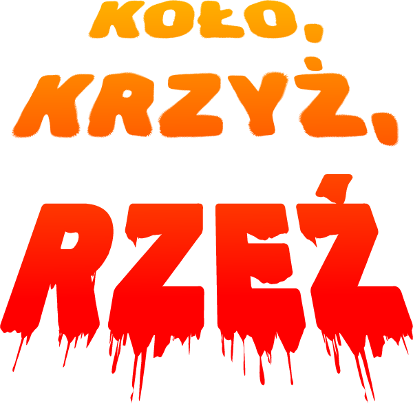

## W świecie, gdzie dwie siły toczą bój o targaną wojną krainę, tylko jedna z nich wyznaczy granicę i obejmie panowanie.
Rok 2048. W postapokaliptycznej galaktyce rządzonej przez gigantyczne korporacje budzisz się ty - cybernetycznie wspomagany żołnierz, który utracił pamięć.  Czy jesteś wybrańcem ze starej przepowiedni?  Czy starczy ci siły, by przetrwać...  KOŁO...  KRZYŻ...  RZEŹ!
